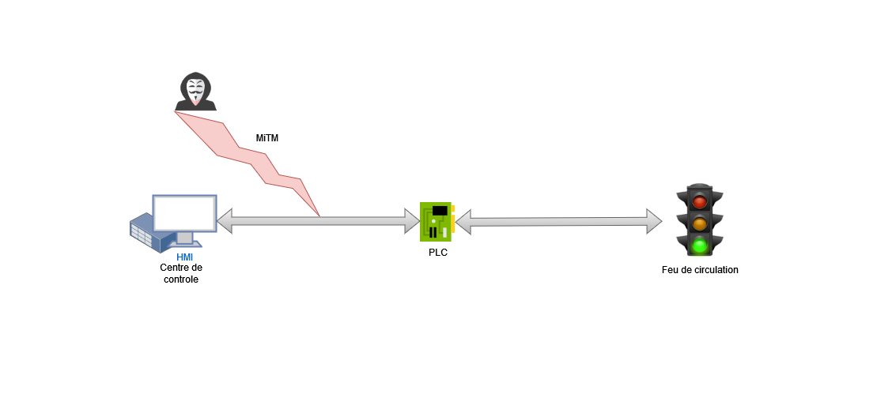

# TLC Cyberattack Simulation
## contexte
Dans le cadre du cours INF6103, il fallait réaliser un banc d'essai pour simuler une attaque sur infrastructure critique. L'infrastructure critique choisi est un système de controle routier.
## banc d'essai et configuration
